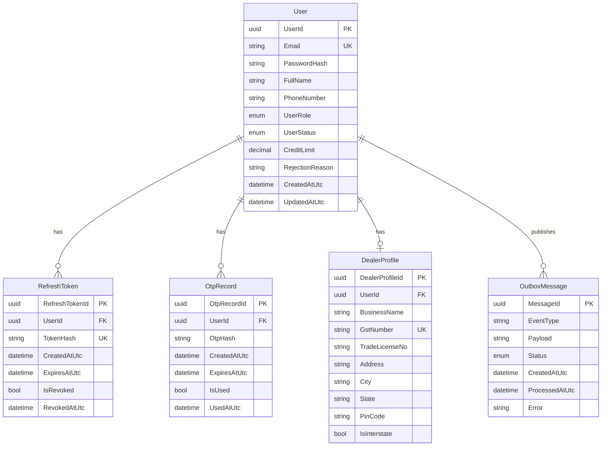
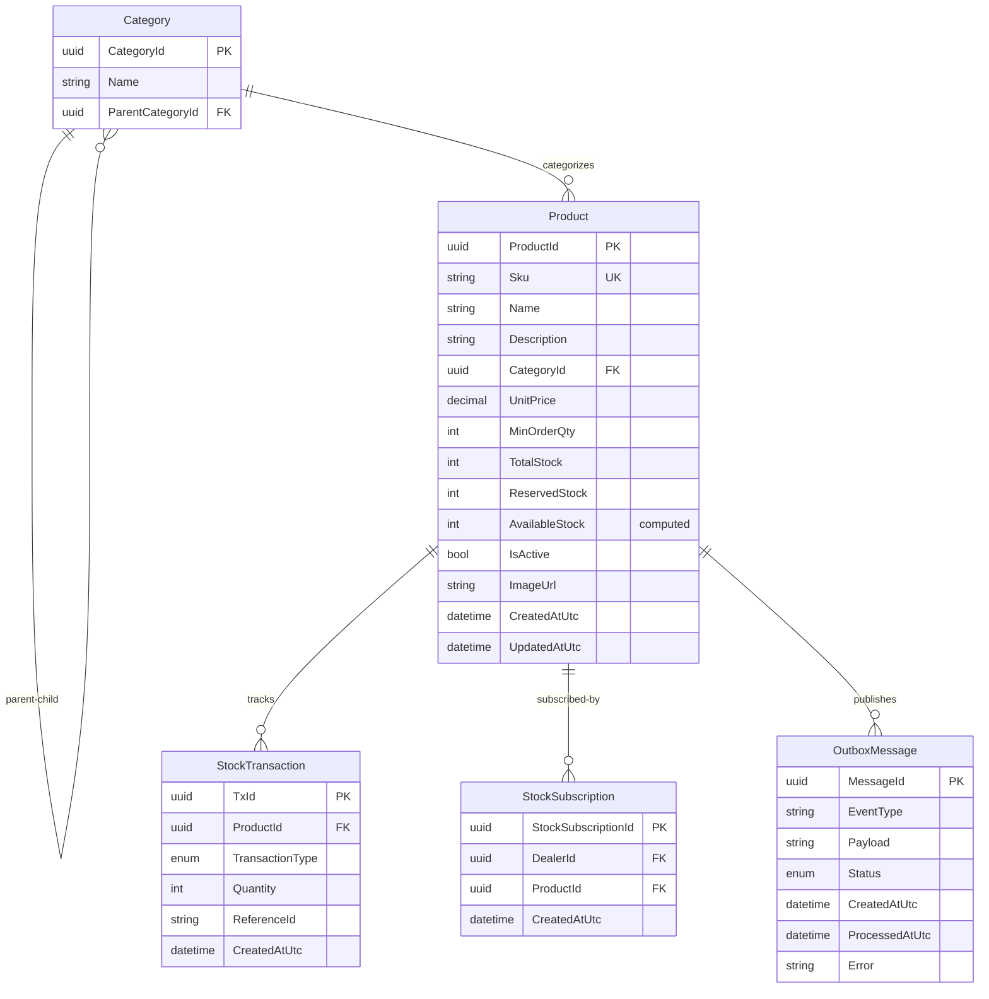
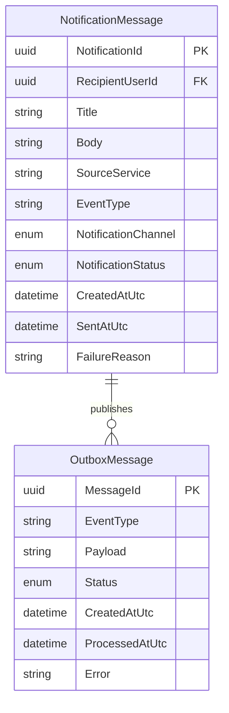
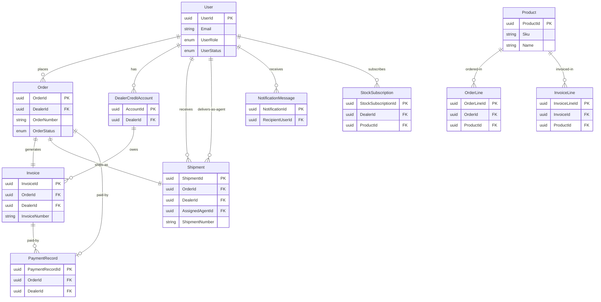

# Supply Chain Management System - Entity Relationship Diagrams

## Complete ER Diagram Overview

This document contains comprehensive Entity-Relationship diagrams for the Supply Chain Management microservices platform.

---

## 1. IdentityAuth Service - ER Diagram



**Enums:**
- UserRole: Admin, WarehouseManager, FinanceManager, LogisticsManager, DeliveryAgent, Dealer
- UserStatus: Pending, Active, Rejected, Suspended

---

## 2. CatalogInventory Service - ER Diagram



**Enums:**
- StockTransactionType: Opening, Restock, Reserve, ReleaseReserve, Deduct, DeductReserved

---

## 3. Order Service - ER Diagram

```mermaid
erDiagram
    OrderAggregate ||--o{ OrderLine : "contains"
    OrderAggregate ||--o{ OrderStatusHistory : "tracks"
    OrderAggregate ||--o| ReturnRequest : "may-have"
    OrderAggregate ||--o| OrderSagaStateEntity : "orchestrates"
    OrderAggregate ||--o{ OutboxMessage : "publishes"

    OrderAggregate {
        uuid OrderId PK
        string OrderNumber UK
        uuid DealerId FK
        enum OrderStatus
        decimal TotalAmount
        enum CreditHoldStatus
        enum PaymentMode
        datetime PlacedAtUtc
        string CancellationReason
    }

    OrderLine {
        uuid OrderLineId PK
        uuid OrderId FK
        uuid ProductId FK
        string ProductName
        string Sku
        int Quantity
        decimal UnitPrice
        decimal LineTotal "computed"
    }

    OrderStatusHistory {
        uuid HistoryId PK
        uuid OrderId FK
        enum FromStatus
        enum ToStatus
        uuid ChangedByUserId FK
        string ChangedByRole
        datetime ChangedAtUtc
    }

    ReturnRequest {
        uuid ReturnRequestId PK
        uuid OrderId FK
        uuid RequestedByDealerId FK
        string Reason
        datetime RequestedAtUtc
        bool IsApproved
        bool IsRejected
        datetime ReviewedAtUtc
    }

    OrderSagaStateEntity {
        uuid OrderId PK_FK
        string OrderNumber
        enum CurrentState
        string LastMessage
        datetime UpdatedAtUtc
    }

    OutboxMessage {
        uuid MessageId PK
        string EventType
        string Payload
        enum Status
        datetime CreatedAtUtc
        datetime ProcessedAtUtc
        string Error
    }
```

**Enums:**
- OrderStatus: Placed, OnHold, Processing, ReadyForDispatch, InTransit, Delivered, Exception, Closed, Cancelled, ReturnRequested, ReturnApproved, ReturnRejected
- CreditHoldStatus: NotRequired, PendingApproval, Approved, Rejected
- PaymentMode: Cash, Credit, UPI

---

## 4. LogisticsTracking Service - ER Diagram

```mermaid
erDiagram
    Shipment ||--o{ ShipmentEvent : "tracks"
    Shipment ||--o| ShipmentOpsState : "manages"
    Shipment ||--o{ OutboxMessage : "publishes"

    Shipment {
        uuid ShipmentId PK
        uuid OrderId FK
        uuid DealerId FK
        string ShipmentNumber UK
        string DeliveryAddress
        string City
        string State
        string PostalCode
        uuid AssignedAgentId FK
        string VehicleNumber
        enum AssignmentDecisionStatus
        string AssignmentDecisionReason
        datetime AssignmentDecisionAtUtc
        int DeliveryAgentRating
        string DeliveryAgentRatingComment
        datetime DeliveryAgentRatedAtUtc
        uuid DeliveryAgentRatedByUserId FK
        enum ShipmentStatus
        datetime CreatedAtUtc
        datetime DeliveredAtUtc
    }

    ShipmentEvent {
        uuid ShipmentEventId PK
        uuid ShipmentId FK
        enum ShipmentStatus
        string Note
        uuid UpdatedByUserId FK
        string UpdatedByRole
        datetime CreatedAtUtc
    }

    ShipmentOpsState {
        uuid ShipmentId PK_FK
        enum HandoverState
        string HandoverExceptionReason
        bool RetryRequired
        int RetryCount
        string RetryReason
        datetime NextRetryAtUtc
        datetime LastRetryScheduledAtUtc
        datetime UpdatedAtUtc
    }

    OutboxMessage {
        uuid MessageId PK
        string EventType
        string Payload
        enum Status
        datetime CreatedAtUtc
        datetime ProcessedAtUtc
        string Error
    }
```

**Enums:**
- ShipmentStatus: Created, Assigned, PickedUp, InTransit, OutForDelivery, Delivered, Returned, Exception
- AssignmentDecisionStatus: Pending, Accepted, Rejected
- HandoverState: Pending, Ready, InProgress, Completed, Exception

---

## 5. PaymentInvoice Service - ER Diagram

```mermaid
erDiagram
    DealerCreditAccount ||--o{ OutboxMessage : "publishes"
    Invoice ||--o{ InvoiceLine : "contains"
    Invoice ||--o| InvoiceWorkflowState : "tracks"
    Invoice ||--o{ InvoiceWorkflowActivity : "logs"
    Invoice ||--o{ OutboxMessage : "publishes"
    PaymentRecord ||--o{ OutboxMessage : "publishes"

    DealerCreditAccount {
        uuid AccountId PK
        uuid DealerId FK_UK
        decimal CreditLimit
        decimal CurrentOutstanding
        decimal AvailableCredit "computed"
    }

    Invoice {
        uuid InvoiceId PK
        string InvoiceNumber UK
        uuid OrderId FK
        uuid DealerId FK
        string IdempotencyKey UK
        decimal Subtotal
        enum GstType
        decimal GstRate
        decimal GstAmount
        decimal GrandTotal
        string PdfStoragePath
        datetime CreatedAtUtc
    }

    InvoiceLine {
        uuid InvoiceLineId PK
        uuid InvoiceId FK
        uuid ProductId FK
        string ProductName
        string Sku
        string HsnCode
        int Quantity
        decimal UnitPrice
        decimal LineTotal "computed"
    }

    InvoiceWorkflowState {
        uuid InvoiceId PK_FK
        enum InvoiceWorkflowStatus
        datetime DueAtUtc
        datetime PromiseToPayAtUtc
        datetime NextFollowUpAtUtc
        string InternalNote
        int ReminderCount
        datetime LastReminderAtUtc
        datetime UpdatedAtUtc
    }

    InvoiceWorkflowActivity {
        uuid ActivityId PK
        uuid InvoiceId FK
        enum InvoiceWorkflowActivityType
        string Message
        string CreatedByRole
        datetime CreatedAtUtc
    }

    PaymentRecord {
        uuid PaymentRecordId PK
        uuid OrderId FK
        uuid DealerId FK
        enum PaymentMode
        decimal Amount
        string ReferenceNo
        datetime CreatedAtUtc
    }

    OutboxMessage {
        uuid MessageId PK
        string EventType
        string Payload
        enum Status
        datetime CreatedAtUtc
        datetime ProcessedAtUtc
        string Error
    }
```

**Enums:**
- GstType: CGST_SGST, IGST
- InvoiceWorkflowStatus: Pending, FollowUp, PromiseToPay, Overdue, Paid, Cancelled
- InvoiceWorkflowActivityType: Created, Reminder, FollowUp, PromiseToPay, PaymentReceived, Cancelled
- PaymentMode: Cash, Credit, UPI

---

## 6. Notification Service - ER Diagram



**Enums:**
- NotificationChannel: InApp, Email, SMS
- NotificationStatus: Pending, Sent, Failed

---

## Cross-Service Relationships



---

## System Architecture Overview

### Microservices:
1. **IdentityAuth**: User management, authentication, dealer profiles
2. **CatalogInventory**: Product catalog, stock management, categories
3. **Order**: Order processing, saga orchestration, returns
4. **LogisticsTracking**: Shipment tracking, delivery agent assignment
5. **PaymentInvoice**: Invoice generation, payment processing, credit management
6. **Notification**: Multi-channel notifications (Email, InApp, SMS)

### Key Patterns:
- **Event-Driven Architecture**: All services use OutboxMessage for reliable event publishing
- **Saga Pattern**: Order service orchestrates distributed transactions
- **CQRS**: Separate read/write models with event sourcing
- **Domain-Driven Design**: Aggregate roots, value objects, domain events

### Data Consistency:
- Each microservice has its own database
- Cross-service references use GUIDs (DealerId, ProductId, OrderId)
- Eventual consistency through domain events
- Idempotency keys for duplicate prevention

---

## Database Statistics

| Service | Entities | Enums | Value Objects | Total Tables |
|---------|----------|-------|---------------|--------------|
| IdentityAuth | 4 | 2 | 1 | 5 |
| CatalogInventory | 5 | 1 | 0 | 5 |
| Order | 6 | 3 | 0 | 6 |
| LogisticsTracking | 4 | 3 | 0 | 4 |
| PaymentInvoice | 7 | 4 | 0 | 7 |
| Notification | 2 | 2 | 0 | 2 |
| **Total** | **28** | **15** | **1** | **29** |

---

## Key Business Rules

### Order Lifecycle:
1. Order Placed → Credit Check (if Credit mode)
2. If Credit Hold → Admin Approval Required
3. Processing → Inventory Reserved
4. Ready for Dispatch → Invoice Generated
5. In Transit → Shipment Tracking Active
6. Delivered → Payment Due (if Credit)
7. Return Window: 48 hours from delivery

### Credit Management:
- Default Credit Limit: ₹500,000
- Credit Hold triggers admin approval
- Invoice Due: 7 days from generation
- Automated reminders and follow-ups

### Inventory Management:
- Soft Reserve: Temporary hold during order processing
- Hard Deduct: Permanent reduction on dispatch
- Stock Subscriptions: Notify dealers when restocked

### Shipment Assignment:
- Agent can Accept or Reject assignment
- Vehicle assignment required before delivery
- Delivery agent rating (1-5 stars) post-delivery

---

*Generated for Supply Chain Management System*  
*Date: 2026-04-14*
