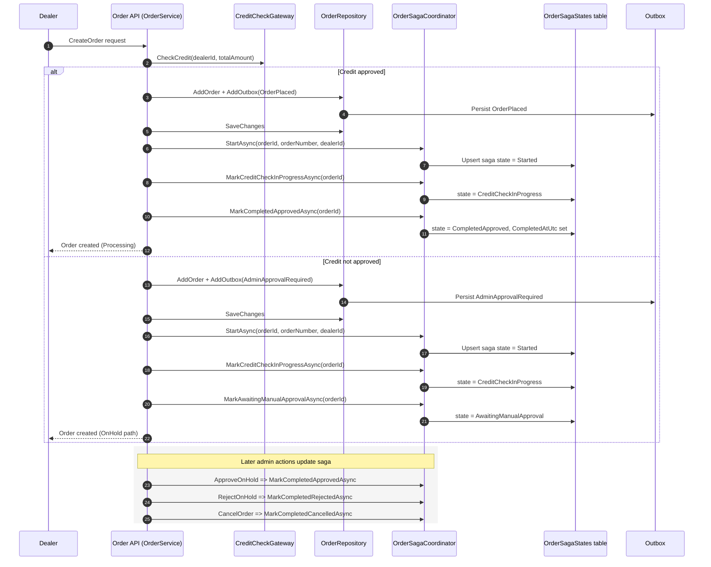

# Order Orchestration Saga Sequence Diagram

```mermaid
sequenceDiagram
    autonumber
    participant D as Dealer
    participant API as Order API (OrderService)
    participant CG as CreditCheckGateway
    participant OR as OrderRepository
    participant S as OrderSagaCoordinator
    participant DB as OrderSagaStates table
    participant OX as Outbox

    D->>API: CreateOrder request
    API->>CG: CheckCredit(dealerId, totalAmount)

    alt Credit approved
        API->>OR: AddOrder + AddOutbox(OrderPlaced)
        OR->>OX: Persist OrderPlaced
        API->>OR: SaveChanges
        API->>S: StartAsync(orderId, orderNumber, dealerId)
        S->>DB: Upsert saga state = Started
        API->>S: MarkCreditCheckInProgressAsync(orderId)
        S->>DB: state = CreditCheckInProgress
        API->>S: MarkCompletedApprovedAsync(orderId)
        S->>DB: state = CompletedApproved, CompletedAtUtc set
        API-->>D: Order created (Processing)
    else Credit not approved
        API->>OR: AddOrder + AddOutbox(AdminApprovalRequired)
        OR->>OX: Persist AdminApprovalRequired
        API->>OR: SaveChanges
        API->>S: StartAsync(orderId, orderNumber, dealerId)
        S->>DB: Upsert saga state = Started
        API->>S: MarkCreditCheckInProgressAsync(orderId)
        S->>DB: state = CreditCheckInProgress
        API->>S: MarkAwaitingManualApprovalAsync(orderId)
        S->>DB: state = AwaitingManualApproval
        API-->>D: Order created (OnHold path)
    end

    rect rgb(245,245,245)
    note over API,S: Later admin actions update saga
    API->>S: ApproveOnHold => MarkCompletedApprovedAsync
    API->>S: RejectOnHold => MarkCompletedRejectedAsync
    API->>S: CancelOrder => MarkCompletedCancelledAsync
    end
```
