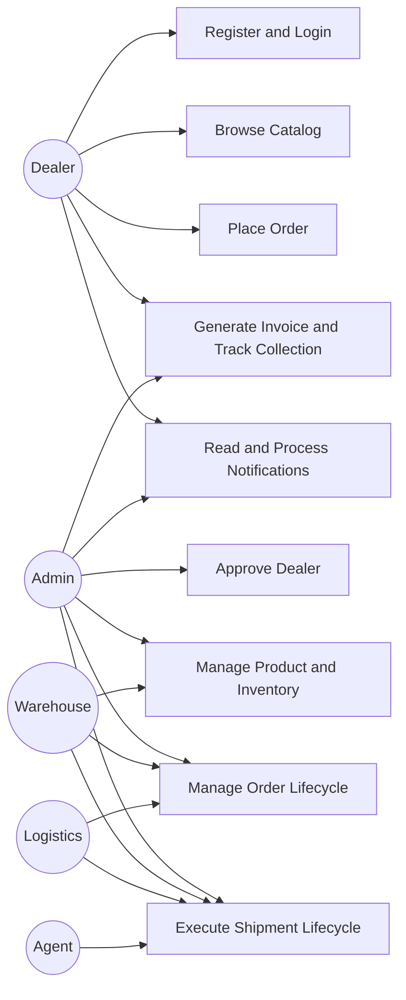
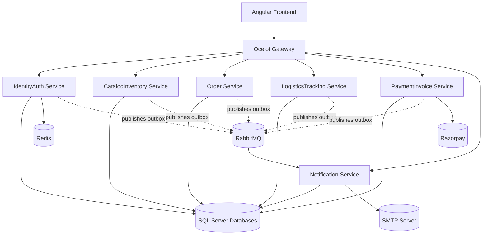
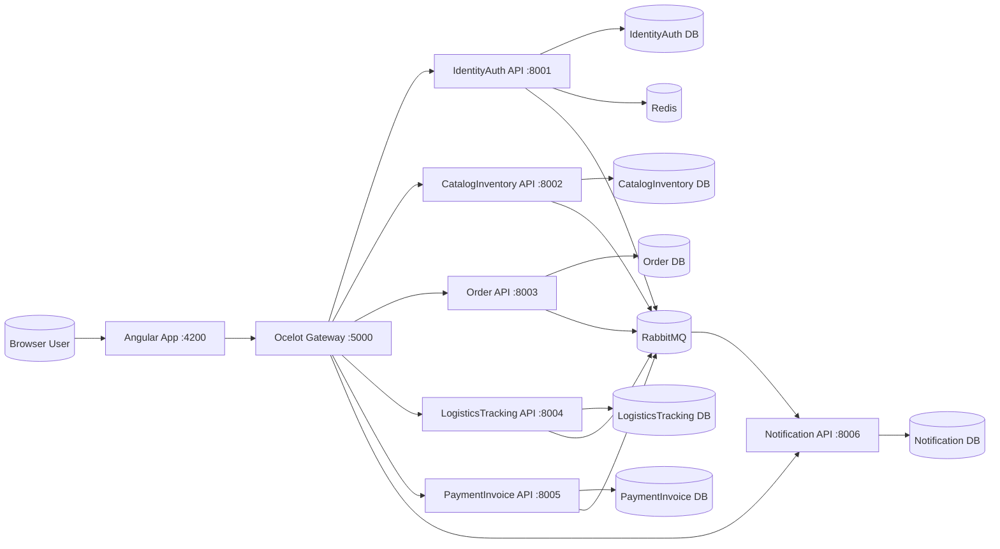
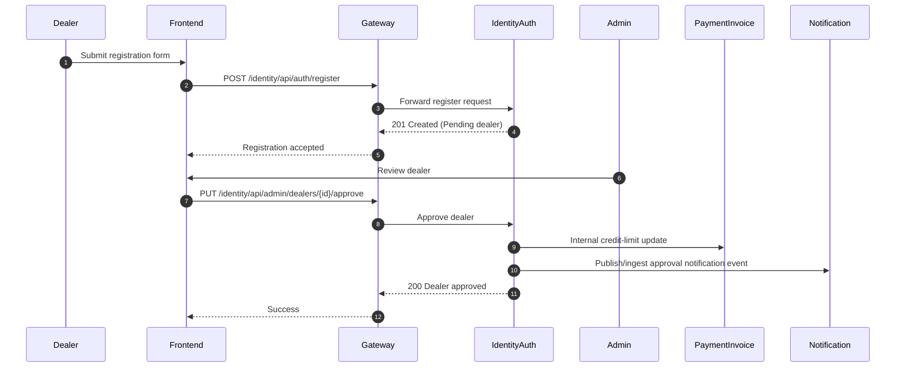
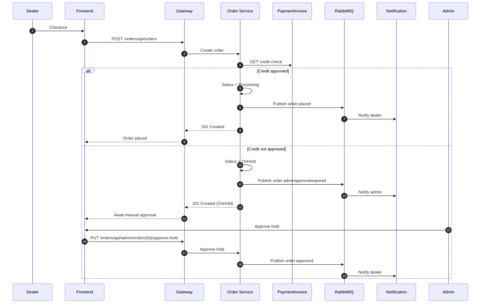
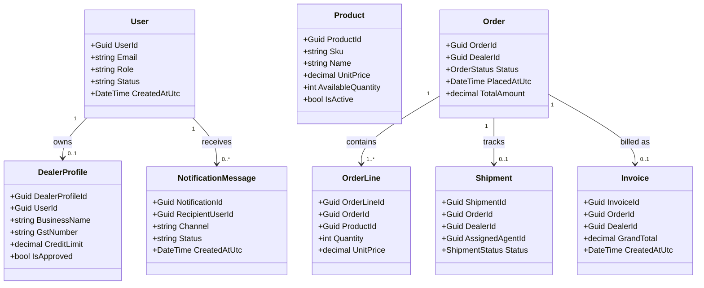
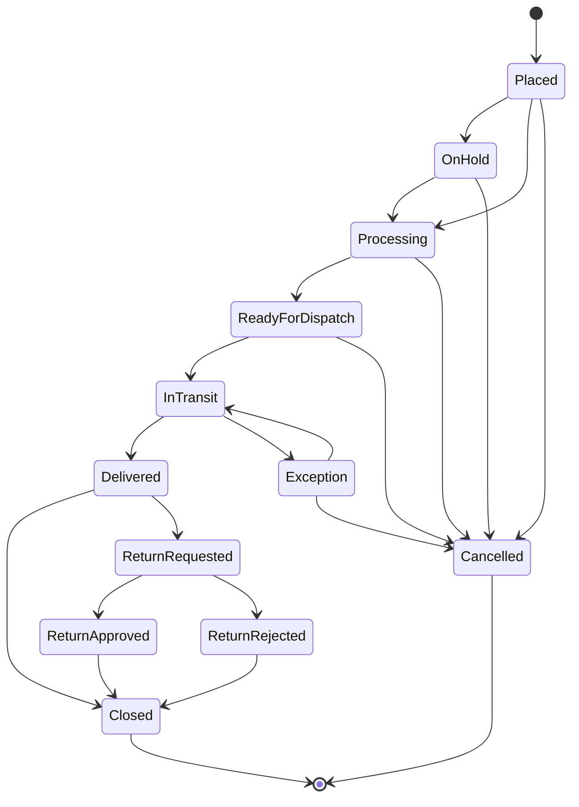
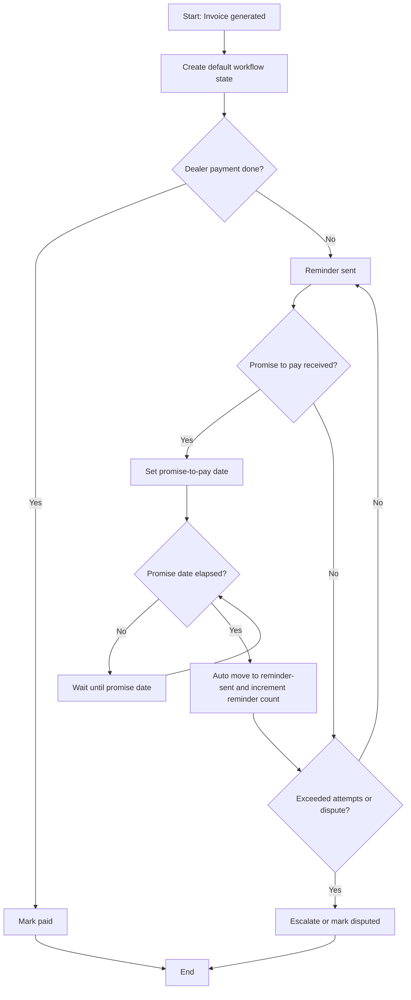

# Supply Chain Platform UML Diagram Pack

## 1. Use Case View

## 2. Component Diagram

## 3. Deployment Diagram

## 4. Sequence Diagram - Dealer Onboarding

## 5. Sequence Diagram - Order and Hold Path

## 6. Class Diagram (Core Domain Snapshot)

## 7. State Diagram - Order Lifecycle

## 8. Activity Diagram - Invoice Collection Workflow

